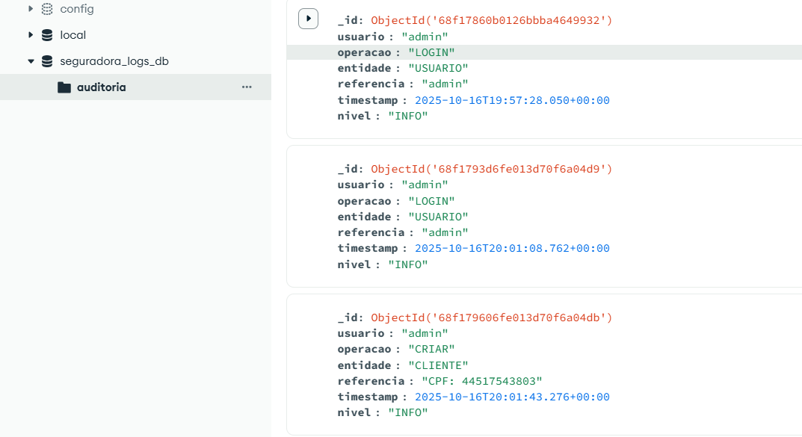
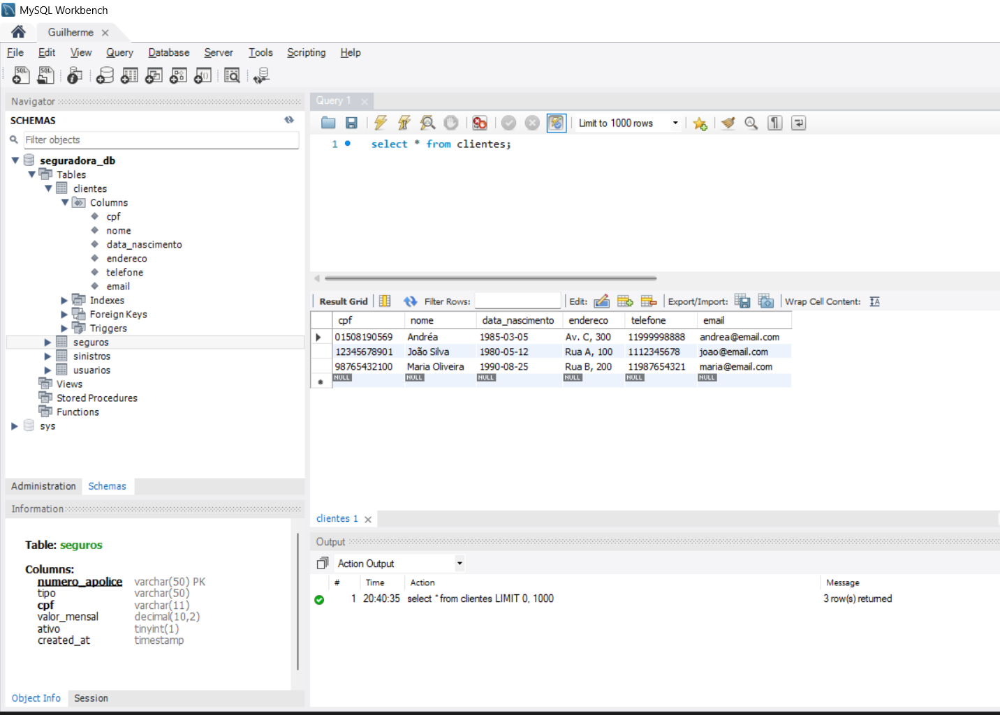

# Sistema de Seguros – Challenge Sprint 4 - Computational Thinkinh with Python

Este repositório contém o código-fonte do projeto de sistema de gerenciamento de seguros, focado na integração de bancos de dados, testes automatizados e padronização de código.

## Integrantes do Grupo:

 - Guilherme Gama Bitencourt Souza | RM 565293

 - Carolina Novakc Moraes | RM 565621

## Visão Geral do Projeto e da Sprint 4

O objetivo deste projeto é simular um sistema robusto para uma seguradora, permitindo o gerenciamento completo de clientes, apólices e sinistros.

Nesta Sprint 4, o foco foi evoluir a arquitetura de persistência e garantir a qualidade e manutenibilidade do código. As principais implementações foram:


 - Persistência Híbrida: A aplicação agora utiliza MySQL para armazenar os dados de negócio (clientes, seguros, etc.) e MongoDB para registrar logs detalhados de auditoria de todas as operações, garantindo um sistema mais seguro e rastreável.


 - Camada de Serviço: Foi implementada uma camada de serviço que orquestra as interações entre a interface do usuário e os bancos de dados, centralizando as regras de negócio.


 - Testes Automatizados: A base para uma suíte de testes automatizados foi criada utilizando pytest, com o objetivo de validar as regras de negócio centrais.


 - Padronização de Código: Foram adotadas as ferramentas black e ruff para garantir um padrão de formatação e qualidade de código consistente em todo o projeto.

## Pré-requisitos e Preparação do Ambiente

Para executar este projeto, você precisará dos seguintes softwares instalados:

 - Python 3.10+

 - Docker e Docker Compose (método recomendado para os bancos de dados)
   
### 1. Clonar o Repositório

```bash
git clone https://github.com/guilhermegamabs/2-semestre-cs-4-python
cd seu-repositorio
```

### 2. Configurar os Bancos de Dados com Docker

A forma mais simples de subir o MySQL e o MongoDB é usando o Docker. Crie um arquivo docker-compose.yml na raiz do projeto com o seguinte conteúdo:

```yaml
version: '3.8'
services:
  mysql-seguradora:
    image: mysql:8.0
    container_name: mysql_seguradora
    restart: unless-stopped
    environment:
      MYSQL_ROOT_PASSWORD: sua_senha_aqui # Use a mesma senha do .env
      MYSQL_DATABASE: seguradora_db # Opcional, o script de init também cria
    ports:
      - "3306:3306"
    volumes:
      - mysql_data:/var/lib/mysql

  mongodb-seguradora:
    image: mongo:latest
    container_name: mongodb_seguradora
    restart: unless-stopped
    ports:
      - "27017:27017"
    volumes:
      - mongo_data:/data/db

volumes:
  mysql_data:
  mongo_data:
```

Após criar o arquivo, inicie os containers:

```bash
docker-compose up -d
```

### 3. Configurar o Ambiente Python

Crie um ambiente virtual e instale as dependências.

```bash
# Crie e ative o ambiente virtual
python -m venv venv
# No Windows:
venv\Scripts\activate
# No macOS/Linux:
# source venv/bin/activate

# Instale os pacotes necessários
pip install mysql-connector-python pymongo python-dotenv pytest pytest-cov black ruff
```

### 4. Configurar Variáveis de Ambiente

Crie um arquivo chamado .env na raiz do projeto. Ele guardará suas senhas de forma segura.

```bash
# --- Configurações do MySQL ---
MYSQL_HOST=127.0.0.1
MYSQL_USER=root
MYSQL_PASSWORD=sua_senha_aqui # <-- COLOQUE A SENHA DO docker-compose.yml
MYSQL_DB=seguradora_db
MYSQL_PORT=3306

# --- Configurações do MongoDB ---
MONGO_URI=mongodb://localhost:27017/
MONGO_DB_LOGS=seguradora_logs_db
```

## Como Executar a Aplicação

Com o ambiente configurado, siga estes dois passos:

### 1. Inicializar o Banco de Dados (executar apenas uma vez): 

Este script criará o banco de dados seguradora_db no MySQL (se não existir), criará todas as tabelas e inserirá alguns dados iniciais para teste.

```bash
python src/inicializar_banco.py
```

### 2. Iniciar o Sistema Principal (CLI): Após a inicialização, execute a interface de linha de comando.

```bash
python src/cli.py
```

### Usuário padrão:
 - Login: admin
 - Senha: 123456

## Como Rodar os Testes e Gerar Cobertura

Nós utilizamos pytest para os testes e pytest-cov para o relatório de cobertura.

**Meta de Cobertura de Testes do Grupo: 70%.**

### 1. Executar a suíte de testes:

```bash
pytest
```

### 2. Gerar o relatório de cobertura: Para um relatório detalhado em HTML, execute o comando abaixo e abra o arquivo htmlcov/index.html em seu navegador.

```bash
pytest --cov=src --cov-report=html
```

## Como Rodar as Ferramentas de Padronização

Utilizamos black para formatação automática e ruff para linting (verificação de erros e estilo).

### 1. Para verificar se o código está formatado e sem erros:

```bash
# Verifica a formatação com black
black --check .

# Verifica erros de linting com ruff
ruff check .
```

### 2. Para corrigir o código automaticamente:
```bash
# Formata o código com black
black .

# Tenta corrigir os erros de linting com ruff
ruff check . --fix
```

## Limitações Conhecidas e Próximos Passos

 - A suíte de testes atual é uma base e deve ser expandida para cobrir mais casos de uso e cenários de falha.

 - Não há um modelo de dados detalhado para os diferentes tipos de seguro (Automóvel, Vida, Residencial).

 - A interface é limitada ao terminal.

## Próximos Passos Sugeridos:

 - Desenvolver uma API REST para expor as funcionalidades do sistema.

 - Criar uma interface web (Front-End) para consumir a API.

 - Expandir a suíte de testes para atingir uma cobertura superior a 85%.

 - Implementar a lógica para armazenar anexos de sinistros no MongoDB.

## Prints dos Bancos para Mostrar Resultados



--- 



